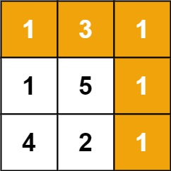

# 最小路径和

Leetcode 64

给定一个包含非负整数的 m x n 网格 grid ，请找出一条从左上角到右下角的路径，使得路径上的数字总和为最小。

说明：每次只能向下或者向右移动一步。




## 题解

和 [不同路径](./unique_paths.md) 类似，就是边界值需要不同处理。

```java
public int minPathSum(int[][] grid) {

    int m = grid.length;
    int n = grid[0].length;
      
    int[][] dp = new int[m][n];
    for(int i = 0;i < m; i++){
        for(int j = 0; j < n; j++){
            if(i == 0 && j == 0){
                dp[i][j] = grid[i][j];
            } else if(i != 0 && j == 0){
                dp[i][j] = grid[i][j] + dp[i-1][j];
            } else if(i == 0 && j != 0){
                dp[i][j] = grid[i][j] + dp[i][j-1];
            } else if(i != 0 && j != 0){
                dp[i][j] = grid[i][j]  + Math.min(dp[i-1][j], dp[i][j-1]);
            }
        }
    }
    return dp[m-1][n-1];
}
```