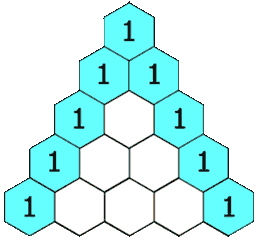

# 杨辉三角

LeetCode 118.

给定一个非负整数 numRows，生成「杨辉三角」的前 numRows 行。

在「杨辉三角」中，每个数是它左上方和右上方的数的和。



示例 1:

输入: numRows = 5
输出: [[1],[1,1],[1,2,1],[1,3,3,1],[1,4,6,4,1]]
示例 2:

输入: numRows = 1
输出: [[1]]


## 题解

规律不难看出，关键的是需要观察到边缘节点都是 1.
```
if (j == 0 || j == i) {
  tmp.add(1);
}
```
这句代码是关键。

---

```java
public List<List<Integer>> generate(int numRows) {
    List<List<Integer>> res = new ArrayList<>();
    for (int i = 0; i < numRows; i++) {
        List<Integer> tmp = new ArrayList<>();
        for (int j = 0; j <= i; j++) {
            if (j == 0 || j == i) {
                tmp.add(1);
            } else {
                tmp.add(res.get(i - 1).get(j-1) + res.get(i - 1).get(j));
            }
        }
        res.add(tmp);
    }
    return res;
}
```

